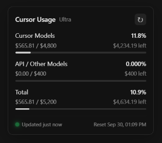

# Cursor Usage Monitor

Shows real dollar limits for Cursor Models, API / Other Models, and Total on the [spending dashboard](https://cursor.com/dashboard/spending).

  

## Install

1. Install [Tampermonkey](https://www.tampermonkey.net/) or [Violentmonkey](https://violentmonkey.github.io/).
2. Click **[Install the script](https://github.com/AryaPaw/cursor-usage-monitor/raw/main/cursor-usage-monitor.user.js)** and confirm.

Open [cursor.com/dashboard/spending](https://cursor.com/dashboard/spending) while signed in. The panel updates itself. New script versions install automatically.

The script runs only on that page and uses your Cursor session. It does not send data anywhere else.

[MIT](LICENSE)
